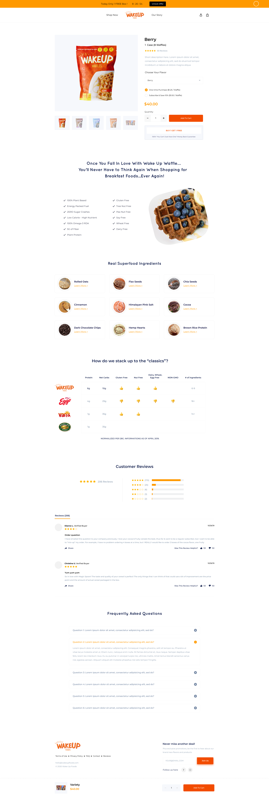

 

### Project Goal
The goal was to build the best customer experience for everyone who wants to buy waffles.
 
 

### Solution
I worked to improve the look, feel and functionality of the website. I used a complete range of fidelity to support decision-making including sketches, user flows, wireframes, mockups and prototypes.
 
 
 

## Wireframes
 

#### Home Page
 

 
 
 

#### Product Page
 

 
 
 

## High-Fidelity Design
 

#### Home Page
 

 
 
 

#### Product Page
 

